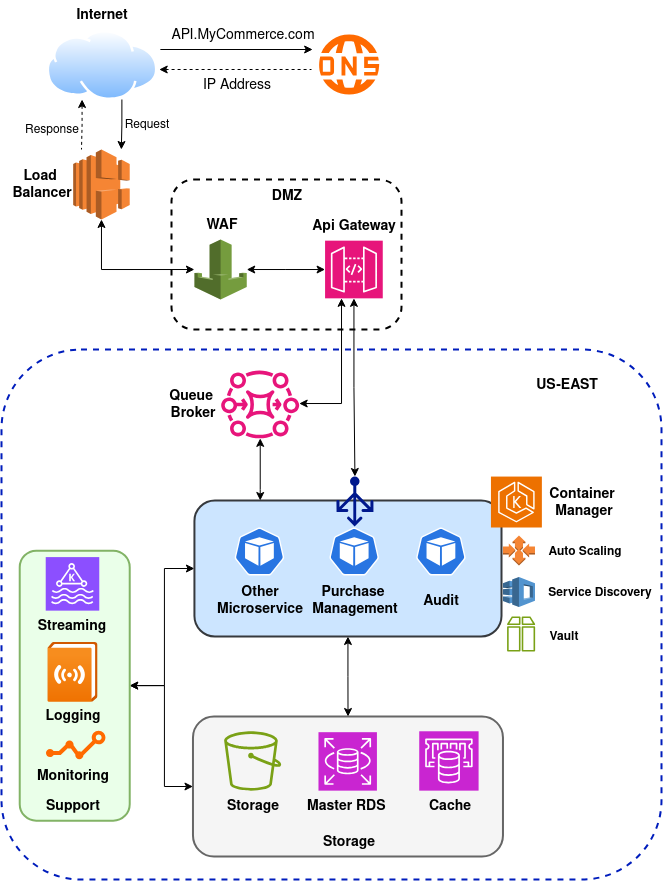

# eCommerce Purchase Management Service

First of all, I would like to thank you for the opportunity. This project was hard work but also very entertaining.
						
**This project has a particular way to be tested, please read the all documentation to understand.**

---

## Security

This project has **JWT** and **mTLS** implemented.

Under `src/main/resources/certs` there are 5 certificates:
 - client-cert.pem
 - client-key.pem
 - client-keystore.p12
 - server-keystore.p12
 - server-trustsrore.p12

Should they be placed together with the code? Of course not, but it makes easier for us to test.
<br>You can use the **client-keystore.p12** in your browser to see the Swagger and the **client-cert.pem** and the **client-key.pem** in your test tool.

All security configurations are placed in  

``` 
net.mycompany.commerce.purchasemgmt
├── infrastructure
    ├── config
        ├── security
            ├── AuthController.java              # Controller for authentication endpoints
            ├── AuthRequest.java                 # DTO for authentication requests
            ├── JwtAuthenticationFilter.java     # Filter for JWT authentication
            ├── JwtService.java                  # Service for JWT operations
            └── SecurityConfig.java              # Security configuration for the application
```

---

## Audit

This project has a **Mock Audit** simulation. 

Every time a purchase is stored in the database, a (mock) Kafka event runs asynchronously to allow the Audit Service to audit the purchase. 
(the request publish is just a log line)
  
The Audit logic is placed in

``` 
net.mycompany.commerce.purchasemgmt
├── infrastructure
    ├── config
        ├── audit
            ├── AuditObserver.java               # Observes and handles audit events
            ├── AuditOperation.java              # Enum for audit operations
            ├── PurchaseTransactionSubject.java  # Subject for purchase transaction audit events
            └── TransactionObserver.java         # Observes transaction events for auditing
```
---

## Cache

This project has a **Spring Cache** implementation to emulate a **cache-aside pattern** with a real key/value memory database.

Since this project is an opportunity to show you what I know, I felt free to add a Requirement #3 in order to implement Cache in this project:

 - **Today's Exchange Rates from the countries MyCompany operates in must be retrieved every day and must be cached due to high demand.** 

So when a client makes a purchase and right away asks for Exchange, the Exchange Rate will be retrieved from the Cache.

The Cache is configured in

``` 
net.mycompany.commerce.purchasemgmt
├── infrastructure
    ├── config
        ├── cache
            ├── CacheConfig.java                 # Configuration for caching
            └── CacheService.java                # Service for cache operations
```

and called after application startup in 

``` 
net.mycompany.commerce.purchasemgmt
├── infrastructure
    ├── integration
        └── treasury
            ├── TreasuryExchangeRateProvider.java    # Implements ExchangeRateProviderPort, fetches rates from Treasury API
```

---

## Scheduler

This project has **Scheduler** implemented

In addition to the Cache, to retrieve the exchanges Rates every day, the U.S Treasury Caching method is executed every 24 hours. 
 
 
---

## Logs

This project **Masks sensitive data in the logs**.

The Purchase amount is set to be masked just as an example. 

---

## Actuator

This project has **Metrics** implemented

health, info, metrics, loggers, env, beans, mappings...

Al can be checking by running 

`https://localhost:8443/actuator/{service}`

---

## Documentation

This project has **Swagger** with **OpenAPI** Documentation for REST API and **Springwolf** for Event-Driven API implemented.

The Rest documentation can be seen in the browser at this location `https://localhost:8443/swagger-ui/index.html` and called by API `https://localhost:8443/v3/api-docs`. 

The Event-Driven Documentation can be seen calling `https://localhost:8443/springwolf/docs` but cannot be seen in a browser because Springwolf need a real server with a real protocol running. Which is not our case.  

The documentation configuration are in 

``` 
net.mycompany.commerce.purchasemgmt
├── infrastructure
    ├── config
        ├── swagger
            └── OpenApiConfig.java               # Configuration for OpenAPI/Swagger documentation
```

and all over the DTOs, Controllers, Consumers and Publishers 

There is no configuration for the Springwolf outside the application.properties


---

## Services

There are two services implemented:

The **Store Purchase** Service saves a new purchase in the database. 

Like the Cache, I added a Requirement #4 in order to implement messaging in this project:

- **Queue must be implemented to Store new Purchases due to high demand**  


The complete logic are implemented in:

``` 
net.mycompany.commerce.purchasemgmt
├── application
    ├── port
    │   └── out
    │       ├── AuditEvent.java                  # Represents an audit event for transaction changes
    │       ├── AuditEventPublisher.java         # Interface for publishing audit events
    │       └── KafkaAuditEventPublisher.java    # Mock implementation for publishing audit events to Kafka
    └── purchase
        ├── consumer
        │   └── PurchaseConsumer.java            # Consumes purchase requests from a queue and processes them
        ├── dto
        │   ├── StorePurchaseRequestDto.java     # DTO for purchase request data (amount, description, date)
        │   └── StorePurchaseResponseDto.java    # DTO for purchase response (transactionId)
        ├── mapper
        │   └── PurchaseTransactionMapper.java   # Maps between StorePurchase DTOs and domain PurchaseTransaction
        ├── publisher
        │   └── PurchasePublisher.java           # Publishes purchase responses to a queue (mock integration)
        └── service
            └── StorePurchaseService.java        # Service for handling purchase transactions (business logic)
```


And the **Currency Exchange** Service converts the purchase amount between different currencies.

The complete logic are implemented in:

``` 
net.mycompany.commerce.purchasemgmt
├── application
│   ├── exchange
│       ├── controller
│       │   └── ExchangeController.java           # REST controller for currency conversion endpoints
│       ├── dto
│       │   ├── ExchangeRateRequestDto.java       # DTO for currency exchange conversion requests
│       │   └── ExchangeRateResponseDto.java      # DTO for currency exchange conversion responses
│       └── service
│           └── CurrencyExchangeService.java      # Service for handling currency conversion logic
│
├── domain
│   ├── model
│   │   ├── AuditOperationType.java              # Enum for audit operation types (CREATE, UPDATE, DELETE)
│   │   ├── Currency.java                        # Entity representing a currency
│   │   └── PurchaseTransaction.java             # Entity representing a purchase transaction
│   ├── port
│   │   ├── ExchangeRateProviderPort.java        # Interface for fetching exchange rates
│   │   └── TransactionIdGeneratorPort.java      # Interface for generating transaction IDs
│   ├── service
│   │   └── PurchaseDomainService.java           # Domain service for purchase business logic
│   └── valueobject
│       ├── ConvertedCurrency.java               # Value object for converted currency
│       ├── ExchangeRate.java                    # Value object for exchange rate
│       └── TransactionId.java                   # Value object for transaction ID
│
├── infrastructure
    ├── integration
        └── treasury
            ├── TreasuryExchangeRateProvider.java    # Implements ExchangeRateProviderPort, fetches rates from Treasury API
            ├── common
            │   └── TreasuryApiConstants.java        # Constants for Treasury API integration
            ├── dto
            │   ├── TreasuryExchangeRateFilterDto.java # DTO for filtering exchange rate queries
            │   ├── ExchangeRateDto.java             # DTO representing exchange rate data
            │   ├── TreasuryExchangeRateResponseDto.java # DTO for Treasury API response
            │   └── TreasuryExchangeRateSortDto.java # Enum for sorting exchange rate queries
            └── mapper
                └── ExchangeRateMapper.java          # Maps Treasury API DTOs to domain ExchangeRate objects
```
 
 
This services could be split into 2 different Microservices, but I decided to put it together for 2 reasons:

 - Implementation Time: I wanted to focus first in other aspects like, auth, log, exception, cache, documentation, etc... 
 - A well made monolith can be better then a lot of Microservices: Microservices can add a lot of governance and maintenance difficulties. If a problem can be well solved with just one application it can be better to maintain.   
 
--- 
 
## Production

The repository **main** branch should have all set to be deployed in production:
	
 - Logs at Error level.
 - Certificates externalized in a secure storage service.
 - Security properties, like JWT and client secrets, in a HSM. 
 - Environment properties 

But, this could make harder for you to test, so this application is **not ready yet** for production.

This project will be closer to production when the next features are implemented. 
 
---
 
## Next Features

I haven’t had time to implement all basic functions for a production environment, so these are the main features that are missing:

- **Observability Integration**
- **Helm charts**
- **CI/CD pipelines**

---

## Tests

This project has **JUnit** Tests implemented.

This is a stand-alone project, which means there is not other tools supporting the execution. 

Therefore, to emulate a MessageQueue tool, two classes was implemented:
	   <br>- ProducerMock
	   <br>- QueueManagerServiceMock

The **ProducerMock** simulates another system sending a message through a queue and then listening another queue to get the response.
<br>The **QueueManagerServiceMock** simulates a QueueManager with the Request and Response queues running. 
<br>Also, there is the **CurrencyInitializerMock** class that create a currency record in the database emulating a already loaded database. 

These classes exist just to help us to test, they are not part of the Purchase Management Project. These should not be in a production environment.  

```
net.mycompany.commerce.mock
│
├── CurrencyInitializerMock.java        # Initializes default currency data for dev/testing
├── ProducerMock.java                   # Mock REST controller for enqueuing purchase requests
└── QueueManagerServiceMock.java        # Simulates queue manager for purchase requests/responses
```

Inside the ProducerMock.java there is a method: 
<br>`POST (/commerce/purchase/v1/store)` emulating a request queue, so this method does not return any data.

and a method:
<br>`GET (/commerce/purchase/v1/{transactionId})`  emulating a response queue, you may call this method only if you wish to emulate a external system receiving the response from another queue.

**but**, to execute the `GET (/commerce/purchase/v1/{transactionId})` and `POST (/purchase/exchange/v1/convertCurrency)` methods from the **ExchangeController** class **you need to retrieve the transactionId from the logs**

Right after calling the `enqueuePurchase` the transactionId will be logged more than once. 

I am attaching my Postman environment and collection in the project root directory to make it easier.

---

## Executing

This project uses **Lombok**, so if you do not already have installed, the Entities, DTOs and ObjectValues may show errors where they are called. 
Install [Lombok](https://projectlombok.org/download) to stop seeing these errors. 

compile and generate jar:

`./gradlew build`  
`./gradlew clean bootJar`   

This is a Spring Boot project with Gradle, so to startup the project, run `./gradlew bootRun` in the project root folder. 

To startup with docker, please run in the project root folder:

`sudo docker build -t purchase-management .`

then

`sudo docker run -p 8443:8443 purchase-management`

---


## All project structure

``` 
net.mycompany.commerce.common
│
├── dto
│   ├── CurrencyDto.java                # DTO for currency details (code, name, country)
│   └── PaginationFiltersDto.java       # DTO for pagination parameters (page number, size)
│
├── mapper
│   └── CurrencyMapper.java             # Maps between Currency domain model and CurrencyDto
│
├── util
│   ├── DateUtils.java                  # Utility for date operations (calculations, checks)
│   └── StringUtils.java                # Utility for string operations (e.g., capitalization)
│
net.mycompany.commerce.mock
│
├── CurrencyInitializerMock.java        # Initializes default currency data for dev/testing
├── ProducerMock.java                   # Mock REST controller for enqueuing purchase requests
└── QueueManagerServiceMock.java        # Simulates queue manager for purchase requests/responses

net.mycompany.commerce.purchasemgmt
│
├── PurchaseManagementApplication.java  # Main Spring Boot application class
│
├── application
│   ├── exchange
│   │   ├── controller
│   │   │   └── ExchangeController.java           # REST controller for currency conversion endpoints
│   │   ├── dto
│   │   │   ├── ExchangeRateRequestDto.java       # DTO for currency exchange conversion requests
│   │   │   └── ExchangeRateResponseDto.java      # DTO for currency exchange conversion responses
│   │   └── service
│   │       └── CurrencyExchangeService.java      # Service for handling currency conversion logic
│   ├── port
│   │   └── out
│   │       ├── AuditEvent.java                  # Represents an audit event for transaction changes
│   │       ├── AuditEventPublisher.java         # Interface for publishing audit events
│   │       └── KafkaAuditEventPublisher.java    # Mock implementation for publishing audit events to Kafka
│   └── purchase
│       ├── consumer
│       │   └── PurchaseConsumer.java            # Consumes purchase requests from a queue and processes them
│       ├── dto
│       │   ├── StorePurchaseRequestDto.java     # DTO for purchase request data (amount, description, date)
│       │   └── StorePurchaseResponseDto.java    # DTO for purchase response (transactionId)
│       ├── mapper
│       │   └── PurchaseTransactionMapper.java   # Maps between StorePurchase DTOs and domain PurchaseTransaction
│       ├── publisher
│       │   └── PurchasePublisher.java           # Publishes purchase responses to a queue (mock integration)
│       └── service
│           └── StorePurchaseService.java        # Service for handling purchase transactions (business logic)
│
├── domain
│   ├── model
│   │   ├── AuditOperationType.java              # Enum for audit operation types (CREATE, UPDATE, DELETE)
│   │   ├── Currency.java                        # Entity representing a currency
│   │   └── PurchaseTransaction.java             # Entity representing a purchase transaction
│   ├── port
│   │   ├── ExchangeRateProviderPort.java        # Interface for fetching exchange rates
│   │   └── TransactionIdGeneratorPort.java      # Interface for generating transaction IDs
│   ├── service
│   │   └── PurchaseDomainService.java           # Domain service for purchase business logic
│   └── valueobject
│       ├── ConvertedCurrency.java               # Value object for converted currency
│       ├── ExchangeRate.java                    # Value object for exchange rate
│       └── TransactionId.java                   # Value object for transaction ID
│
├── infrastructure
│   ├── adapter
│   │   └── NanoIdTransactionIdGeneratorAdapter.java # Adapter for generating transaction IDs using NanoId
│   ├── config
│   │   ├── audit
│   │   │   ├── AuditObserver.java               # Observes and handles audit events
│   │   │   ├── AuditOperation.java              # Enum for audit operations
│   │   │   ├── PurchaseTransactionSubject.java  # Subject for purchase transaction audit events
│   │   │   └── TransactionObserver.java         # Observes transaction events for auditing
│   │   ├── cache
│   │   │   ├── CacheConfig.java                 # Configuration for caching
│   │   │   └── CacheService.java                # Service for cache operations
│   │   ├── exception
│   │   │   ├── ApiError.java                    # Represents API error details
│   │   │   ├── ApiServiceUnavaliableException.java # Exception for unavailable API services
│   │   │   ├── DataBaseNotFoundException.java   # Exception for missing database entries
│   │   │   ├── GlobalExceptionHandler.java      # Handles global exceptions in the application
│   │   │   ├── PurchaseDomainException.java     # Exception for domain errors in purchases
│   │   │   ├── PurchaseExceptionsHandler.java   # Handles purchase-related exceptions
│   │   │   ├── TraceIdFilter.java               # Filter for tracing request IDs
│   │   │   └── UnauthorizedException.java       # Exception for unauthorized access
│   │   ├── rest
│   │   │   ├── BaseApiProperties.java           # Base class for API configuration properties
│   │   │   ├── TreasuryApiProperties.java       # Configuration for Treasury API
│   │   │   ├── WebClientFactory.java            # Factory for creating WebClient instances
│   │   │   └── WebClientLoggingFilters.java     # Logging filters for WebClient
│   │   ├── Scheduler
│   │   │   └── SchedulerConfig.java             # Scheduler configuration
│   │   ├── security
│   │   │   ├── AuthController.java              # Controller for authentication endpoints
│   │   │   ├── AuthRequest.java                 # DTO for authentication requests
│   │   │   ├── JwtAuthenticationFilter.java     # Filter for JWT authentication
│   │   │   ├── JwtService.java                  # Service for JWT operations
│   │   │   └── SecurityConfig.java              # Security configuration for the application
│   │   ├── swagger
│   │   │   └── OpenApiConfig.java               # Configuration for OpenAPI/Swagger documentation
│   │   └── validator
│   │       ├── USDateTimeFormat.java            # Annotation for US date format validation
│   │       └── USDateTimeFormatValidator.java   # Validator for US date format
│   ├── integration
│   │   └── treasury
│   │       ├── TreasuryExchangeRateProvider.java    # Implements ExchangeRateProviderPort, fetches rates from Treasury API
│   │       ├── common
│   │       │   └── TreasuryApiConstants.java        # Constants for Treasury API integration
│   │       ├── dto
│   │       │   ├── TreasuryExchangeRateFilterDto.java # DTO for filtering exchange rate queries
│   │       │   ├── ExchangeRateDto.java             # DTO representing exchange rate data
│   │       │   ├── TreasuryExchangeRateResponseDto.java # DTO for Treasury API response
│   │       │   └── TreasuryExchangeRateSortDto.java # Enum for sorting exchange rate queries
│   │       └── mapper
│   │           └── ExchangeRateMapper.java          # Maps Treasury API DTOs to domain ExchangeRate objects
│   └── repository
│       ├── CurrencyRepository.java                  # JPA repository for Currency entities
│       └── PurchaseTransactionRepository.java       # JPA repository for PurchaseTransaction entities
```


---

# C4 Model — Purchase Management

**Project:** `net.mycompany.commerce.purchasemgmt`

**Overview:** C4 documentation (Context, Containers, Components, Code + flows and sequence diagrams) of the Purchase Management microservice.

---

## 1. System Context (C1)

### 1.1 Functional Summary
The **Purchase Management** is responsible for processing and persisting purchase transactions requests publishing audit events, and converting amounts between currencies by providing endpoints for currency conversion and integrations with external providers (e.g. U.S. Treasury Fiscal Data). It includes components for authentication (JWT), cryptographic protocol (mTls), Cache aside, publish auditing events and Message Queue integration, REST and Event-Driven API documentation. 

### 1.2 External Actors
- **External systems**: Web or mobile app, other commerce microservices or external systems that stores purchases transactions and requests currency conversion.
- **Queue System**: Message broker used to enqueue purchases requests/responses.
- **Treasury API**: External service that provides exchange rates.
- **Audit System**: Publisher of audit events.


### 1.3 Context Diagram


---

## 2. Containers (C2)

### 2.1 Main Containers
- **purchase-management (Spring Boot app)** — main executable exposing REST endpoints and queue consumers.
  - Entrypoint: `PurchaseManagementApplication.java`
  - Cache daily Exchange Rates (Treasury API integration)
  - Exposes HTTP API To Currency Conversion (Auth + Internal endpoints + Treasury API integration)
  - Consumes and publishes messages in Queues to store purchase transactions (Auth + Internal consumer and publisher + Audit transaction)
  - Publishes audit events in external brokers
  - Saves Purchase Transactions in RDBMS Database
  - Provides Technical Documentation for REST API and Queue consumers and publishers
   

- **Database (RDBMS)** — stores `Currency` and `PurchaseTransaction` entities.

- **Queue Events** — queue for purchase requests/responses; `PurchaseConsumer.java ` and `PurchasePublisher.java`.

- **Audit Events** — Publishes requests into external broker; `AuditEvent.java `.

- **Treasury API (external)** — external service to fetch exchange rates `TreasuryExchangeRateProvider.java`.

- **Exchange Rates Cache** — Consumes Treasury API and Cache results `TreasuryExchangeRateProvider.java`.

- **Logging** — Masks sensitive data.

### 2.2 Container Diagram


---

## 3. Components (C3)

### 3.1 Component Map of `application` module (store + exchange)

**Exchange Subsystem**
- `ExchangeController` — REST endpoints for conversion (request/response DTOs: `ExchangeRateRequestDto`, `ExchangeRateResponseDto`).
- `CurrencyExchangeService` — conversion flow: get purchase transaction, retrieves Exchange Rate via `CacheService` or `ExchangeRateProviderPort`, orchestrates domain validations (via `PurchaseDomainService`)and returns `ConvertedCurrency`.

**Store Subsystem**
- `PurchaseConsumer` — listener/consumer receiving `StorePurchaseRequestDto` from the request queue, transforms with `PurchaseTransactionMapper` and calls `StorePurchaseService`.
- `StorePurchaseService` — generates `TransactionId` (via `TransactionIdGeneratorPort`), persists `PurchaseTransaction` and publishes `StorePurchaseResponseDto` to queue via `PurchasePublisher`.
- `PurchasePublisher` — sends the response to response queue.
- `KafkaAuditEventPublisher` — implements `AuditEventPublisher` and sends audit events to Kafka broker.

**Infrastructure/Adapters**
- `NanoIdTransactionIdGeneratorAdapter` — generates IDs (NanoId) implementing `TransactionIdGeneratorPort`.
- `TreasuryExchangeRateProvider` — implements `ExchangeRateProviderPort`, makes calls to Treasury API via `WebClient`.
- `CacheService` — encapsulates cache (configured by `CacheConfig`).
- `TraceIdFilter`, `JwtAuthenticationFilter`, `SecurityConfig` — cross-cutting concerns.

**Repositories / Mappers**
- `CurrencyRepository`, `PurchaseTransactionRepository` — JPA repositories.
- `CurrencyMapper`, `PurchaseTransactionMapper`, `ExchangeRateMapper` — conversions between DTOs/Entities/Domain VOs.

### 3.2 Supporting Components (common + mock)
- `CurrencyDto`, `PaginationFiltersDto`, `CurrencyMapper` — shared DTOs and mappers.

### 3.3 Component Diagram


---

## 4. Main Flows (sequence and events)

### 4.1 Flow: Purchase transaction amount currency conversion (synchronous HTTP)
1. External system calls `POST /purchase/exchange/v1/convertCurrency` on `ExchangeController` with `ExchangeRateRequestDto`.
2. `ExchangeController` validates request and calls `CurrencyExchangeService`.
3. `CurrencyExchangeService` calls `PurchaseTransactionRepository`, get the `PurchaseTransaction` and 
 <br>- call `PurchaseDomainService` sending `PurchaseTransaction`  
4. `PurchaseDomainService` 
 <br>- checks purchase date 
 <br>- If is today, call `CacheService` for country rate.
 <br>- If country rate found or not today, calls `ExchangeRateProviderPort` (`TreasuryExchangeRateProvider`) to fetch rate from Treasury.
 <br>- Calculates Currency Conversion and returns `ConvertedCurrency`.
5. `CurrencyExchangeService` maps `ConvertedCurrency` to `ExchangeRateResponseDto`. 
6. `ExchangeController` responds  `ExchangeRateResponseDto` to client.

**Sequence**


### 4.2 Flow: Store purchase transaction (asynchronous via queue)
1. External system (Producer) publishes `StorePurchaseRequestDto` to the request queue.
2. `PurchaseConsumer` consumes the message, validates and calls `StorePurchaseService`.
3. `StorePurchaseService` 
 <br>- maps `StorePurchaseRequestDto` to `PurchaseTransaction` using `PurchaseTransactionMapper` and generates `TransactionId` using `TransactionIdGeneratorPort` (NanoId adapter).
 <br>- calls `CurrencyRepository` for the default commerce currency and get `Currency`
 <br>- sets `Currency` in `PurchaseTransaction`
 <br>- calls `PurchaseTransactionRepository` and saves `PurchaseTransaction`.
 <br>- maps `PurchaseTransaction` to `StorePurchaseResponseDto` using `PurchaseTransactionMapper`
 <br>- notifies `PurchaseTransactionSubject` creating an `AuditEvent` mapping `PurchaseTransaction`  
 <br>- calls `PurchasePublisher` sending `StorePurchaseResponseDto` 
4. `PurchasePublisher` publishes `StorePurchaseResponseDto` to the response queue.
5. `AuditEventPublisher` publishes asynchronously `AuditEvent` in the request queue.

**Sequence**


---

## 5. Data Models & Contracts

### 5.1 Main Entities
- `Currency` (id, code, name, country)
- `PurchaseTransaction` (id, transactionId, amount, Currency, purchaseDate, description)

### 5.2 DTOs / Contracts / Value Objects
- `ExchangeRateRequestDto` { transactionId, country }
- `ExchangeRateResponseDto` { transactionId, description, purchaseCurrency, purchaseAmount, transactionDate, targetCountry, targetAmount, exchangeRate }
- `StorePurchaseRequestDto` { amount, description, purchaseDate }
- `StorePurchaseResponseDto` { transactionId }
- `CurrencyDto` { code, name, country }
- `AuditEvent` { transactionId, operation, changedBy, changedDate }
- `ExchangeRateDto` { country, currency, exchangeRateAmount, effectiveDate }
- `TreasuryExchangeRateFilterDto` { country, requestDateFrom, requestDateTo, sortBy }
- `TreasuryExchangeRateSortDto` { COUNTRY, EFFECTIVE_DATE }
- `PaginationFiltersDto` { pageNumber, pageSize }
- `TreasuryExchangeRateResponseDto` { data[ExchangeRateDto] }
- `ConvertedCurrency` ( currency, exchangeRateAmount, convertedAmount )
- `ExchangeRate` ( currency, exchangeRateAmount, effectiveDate )
- `TransactionId` ( value )

### 5.3 Queue Events
- `store.purchase.request` — payload `StorePurchaseRequestDto`
- `store.purchase.response` — payload `StorePurchaseResponseDto`
- `audit.event` — payload `AuditEvent`

---

## 6. Non-functional & Cross-cutting

### 6.1 Security
- JWT authentication via `JwtAuthenticationFilter`.
- mTLS cryptographic 
- TraceId propagation via `TraceIdFilter` for log/request correlation.

### 6.2 logging
- TraceId propagation via `TraceIdFilter` for log/request correlation.
- private data mask via Logback 

### 6.3 Performance & Cache
- Cache for exchange rates (TTL configurable in `CacheConfig`).
- Async calls to Audit in `AuditEventPublisher`

### 6.4 Tests
- Mocks (`mock` package) for queueing and currency initialization.
- Unit tests for `PurchaseDomainService`, integration tests for `TreasuryExchangeRateProvider` (using WireMock) and contract tests for the queue.

### 6.5 API Documentation
- Swagger + OpenAPI for REST Endpoints Documentation
- Springwolf for Queue Eventi-Driven API Documentation

### 6.6 Resilience
- Timeouts and retries on calls to `Treasury` with `WebClient` and exponential backoff.
- Using Circuit Breaker (e.g. Resilience4j) when calling `Treasury`.

### 6.6 Metrics
- Actuator Metrics (request count, latency, queue lag, consumer throughput)  


---

## 7. Deployment / Infrastructure (C4 Deployment suggestions)

- **Kubernetes (recommended)**
  - CI pipeline: 
  	<br>- Code Repository Integration (or Artifact repository)
  	<br>- Static Code Analysis (Quality and Vulnerabilities)
  	<br>- Dependency check Analysis (Vulnerabilities)
  	<br>- Container Scan (Vulnerabilities)
  	<br>- Unit and Integration tests
  	<br>- API Contract Tests
  	<br>- Bean Validation Tests
  	<br>- Performance Tests
  	<br>- E2E tests
  	<br>- Resilience Tests
  - CD Pipeline
  	<br>- Version control
  	<br>- Rollback
  	<br>- Permissions  
  - Deployment purchase-management with readiness/liveness probes.
  - Environemnt configuration with Helm manager
  - ConfigMap/Secrets for credentials, JWT secrets, DB connection.
  - Stateful/Deployment for DB (or managed RDS service).
  - Horizontal Pod Autoscaler based on CPU/latency.
  - vertical Pod Autoscaler based on Load.

- **Topology**



---

## 8. Architectural Recommendations & Improvements

1. **DLQ and Retry Policy** for queue consumers; monitor failed messages.
2. **Contracts / Schema Registry** (Avro/JSON Schema) for queue messages to avoid contract break on deploy.
3. **API Gateway** to centralize authentication and routing.
4. **WAF** to request filtering and security.
5. **Migrations (Flyway/Liquibase)** to manage DB schema.
6. **Observability Integration** to security/metrics

---

